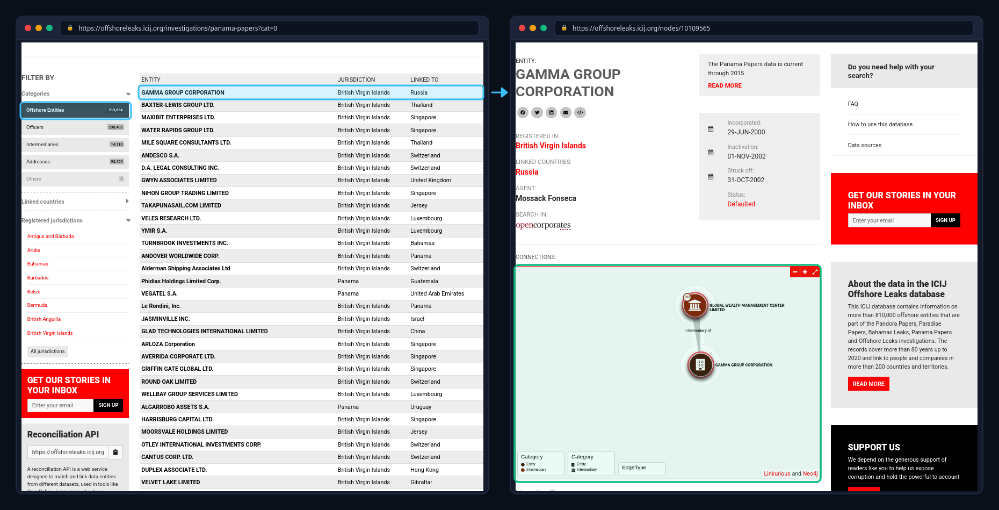

# Post 1: The Panama Papers — Microcontent, Co-Creation, and Exposing Corruption

During 2015-2016, a whistleblower known as "John Doe" who had connections to Mossack Fonseca - a major Panamanian law firm - leaked confidential documents to the German newspaper *Süddeutsche Zeitung* ("The Panama Papers: The Secrets"). They then later shared them with the International Consortium of Investigative Journalists (or ICIJ for short), which is an organization that consists of more than 300 journalists spanning across 80+ countries. They spent months sifting through these documents, uncovering the stories of very wealthy people abusing their power, which later became the Panama Papers (*The Panama Papers: Politicians*). The crux of the matter is that these wealthy people in the documents, who included politicians, used their wealth to scheme their way out of taxation using shell companies. The Panama Papers effectively conveys a narrative around the corruption using interactive microcontent to make the user a co-creator (Alexander 23-30). What this effectively shows is how we can use these techniques in digital storytelling to fight against political corruption. 

The documents that the ICIJ had to work with were formatted as a flat dump containing over 2.6TB of data (*The Panama Papers: Politicians*). For an average user, this would be too much to comprehend. In order to make the data comprehensible, the ICIJ used graph database technology to structure the data. The graph essentially contains nodes that hold entity types. One type is Officers/Beneficiaries, which includes people like politicians; then Offshore Entities, which would be the shell companies; Intermediaries - those who made the process happen; and lastly, the Addresses of registered locations (*Offshore Leaks Database*). The effectiveness of this presentation relates back to Alexander's concept of microcontent - that is, modular units of information that can be linked, searched, and combined (23-30). By categorizing the data and using a graph representation, the user is able to understand the linkages through the web interface.  

Moreover, using the graph representation allows the audience to feel like a "co-creator" (Alexander 23-30). With the combination of employing microcontent alongside affording the user the role of a co-creator, the digital story of the Panama Papers effectively affords the user the ability to understand and form the story on their own. For example, on the website that houses the database, the user is greeted with a search bar. On the left-side navigation panel, they have the options to select the different node types as mentioned before. For any item clicked in the results, they are then greeted with a graph that represents linkages between nodes. If we wanted to know what companies are connected to a shell company, we can select "Offshore Entities" in the left panel, and then in the search results click on an item where we will then be promptly greeted with a graph that displays who is connected (*Offshore Leaks Database*).

With the use of graphs, interactive searches, and categorized entities, it shows how microcontent effectively helps to convey stories when we have massive amounts of data (Alexander 23-30). Affording the user the role of co-creator allows them to effectively understand the story in an interactive way, as if they were the investigator. Using these techniques in digital storytelling shows how we can use these methods to ultimately fight against political corruption.

*Fig. 1. Workflow of a user selecting an item from the list of Offshore Entities, then viewing the graph of connections.*

## Works Cited

Alexander, Bryan. *The New Digital Storytelling: Creating Narratives with New Media*. 2nd ed., Praeger, 2017.

*Offshore Leaks Database*. International Consortium of Investigative Journalists, 2016, https://offshoreleaks.icij.org/. Accessed 27 Sept. 2026.

*The Panama Papers: Politicians, Criminals and the Rogue Industry That Hides Their Cash*. International Consortium of Investigative Journalists, 2016, https://www.icij.org/investigations/panama-papers/. Accessed 27 Sept. 2026.

"The Panama Papers: The Secrets of Dirty Money." *Süddeutsche Zeitung*, 2016, https://panamapapers.sueddeutsche.de/en/. Accessed 27 Sept. 2026.
